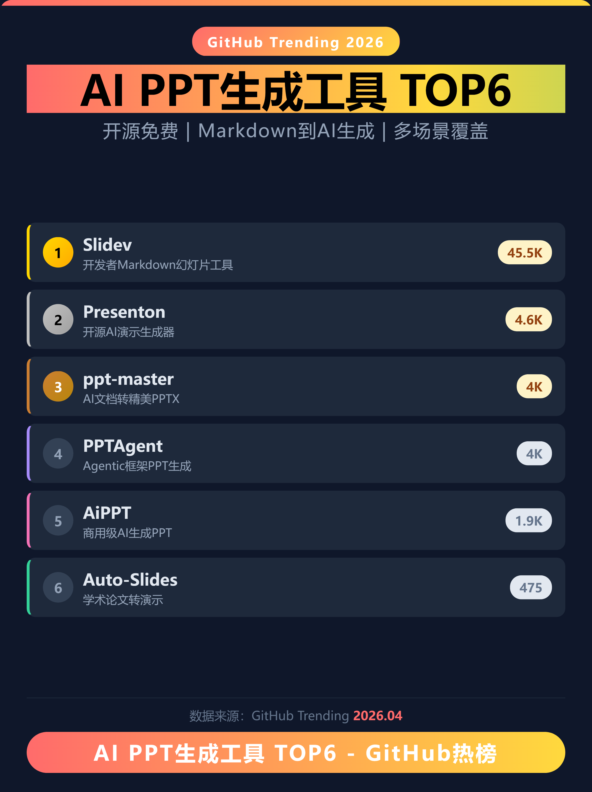
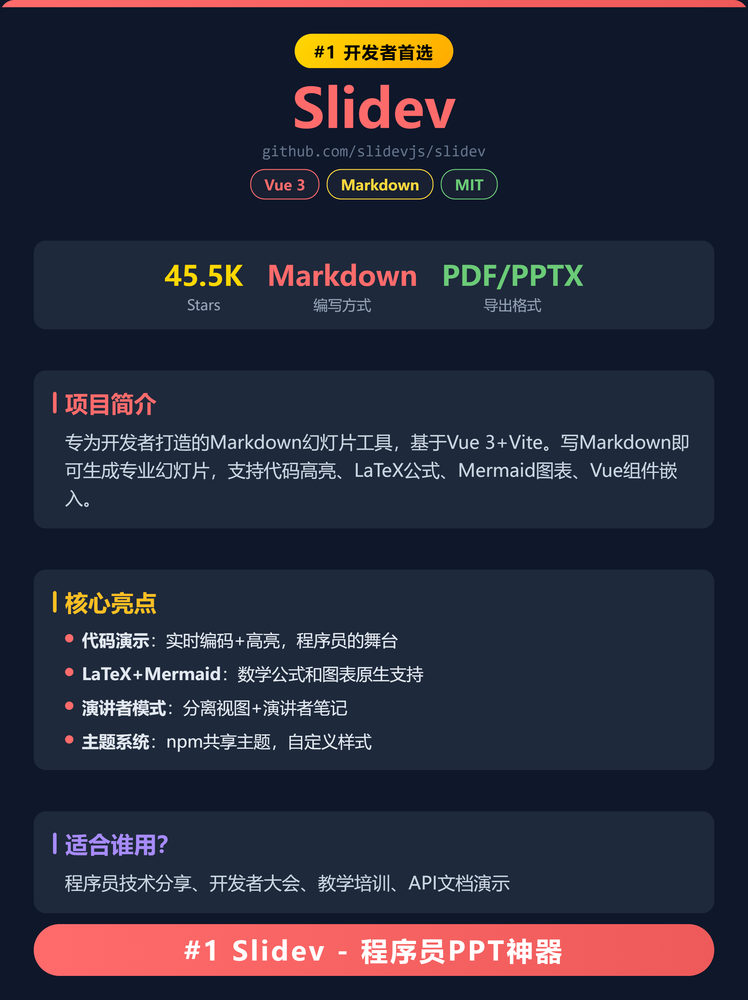
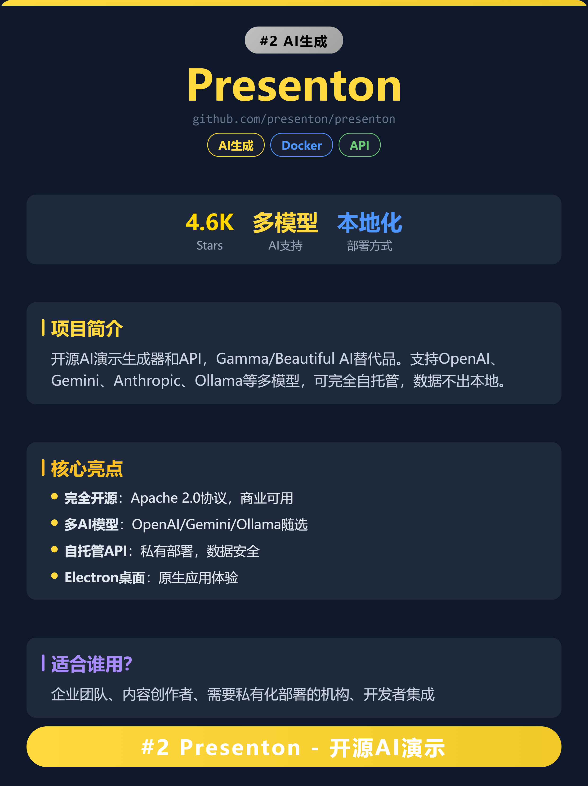
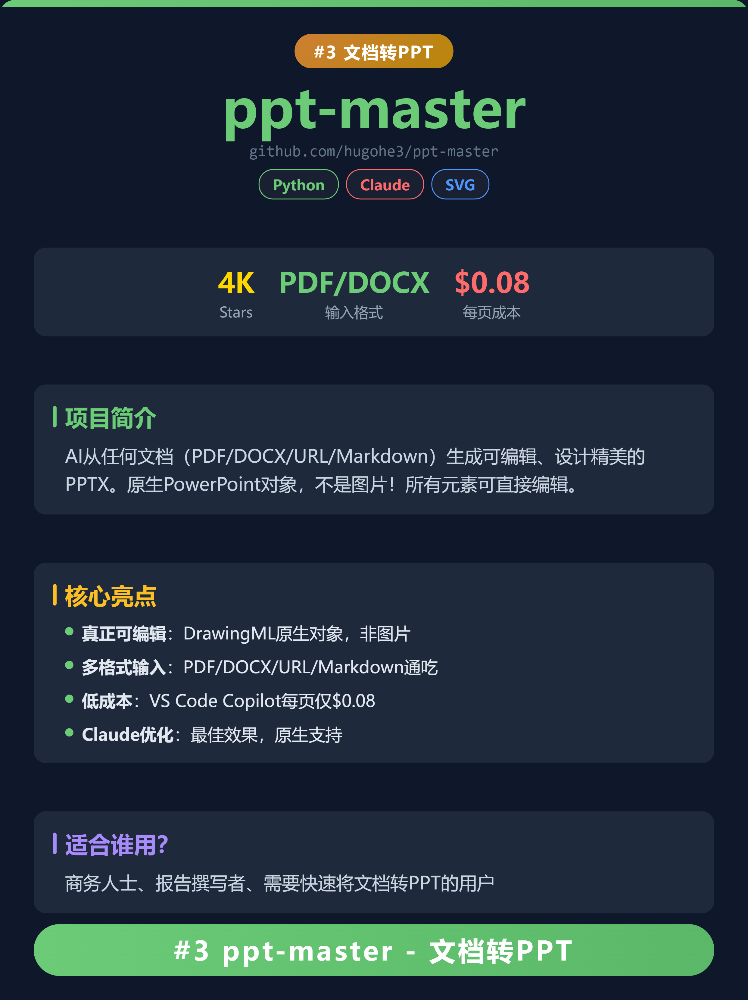
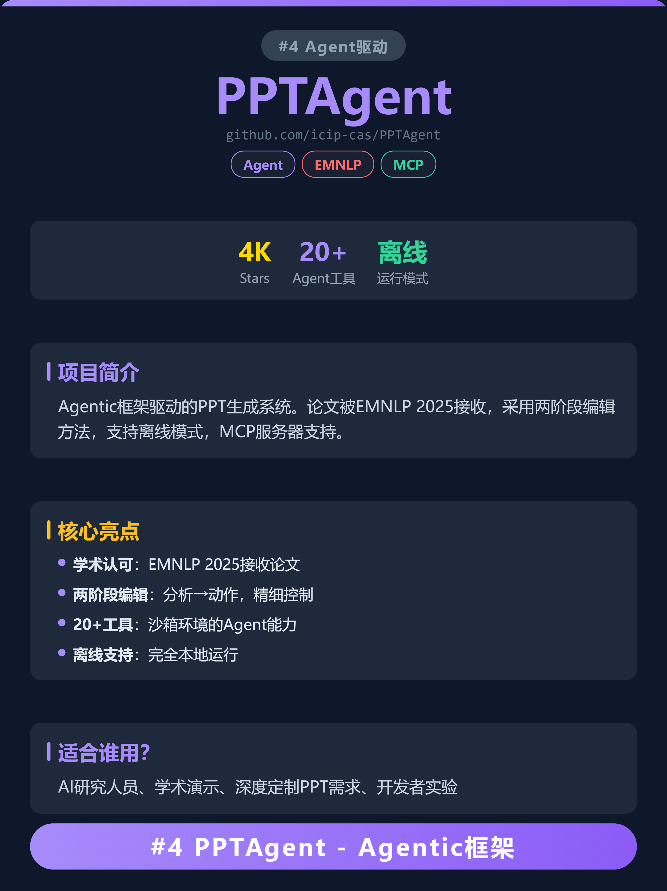
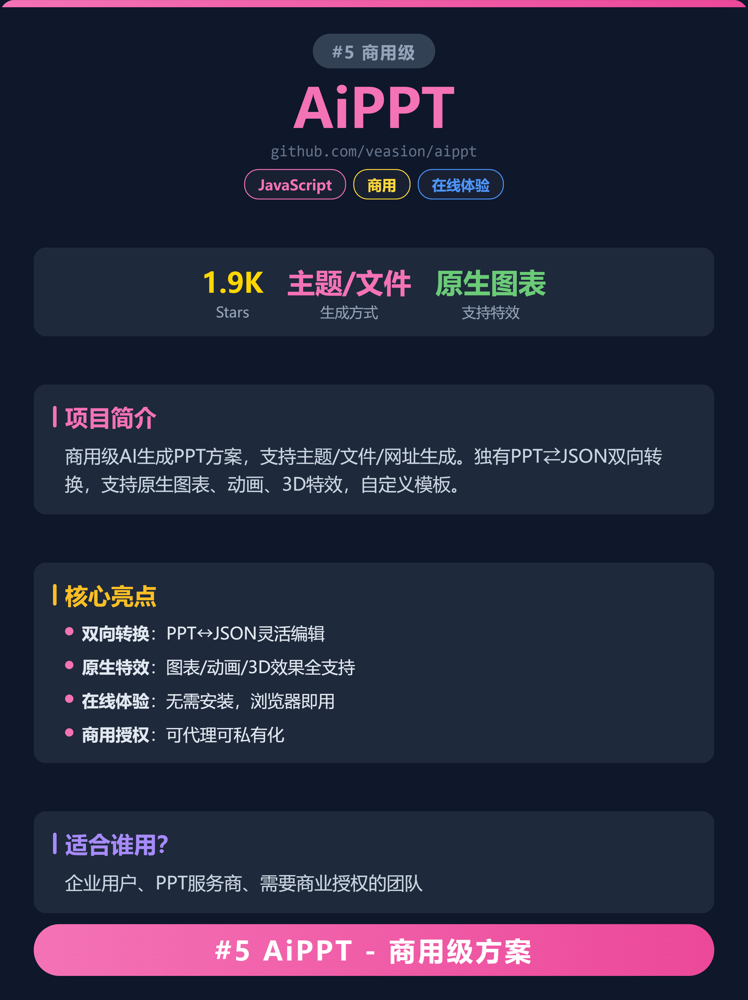
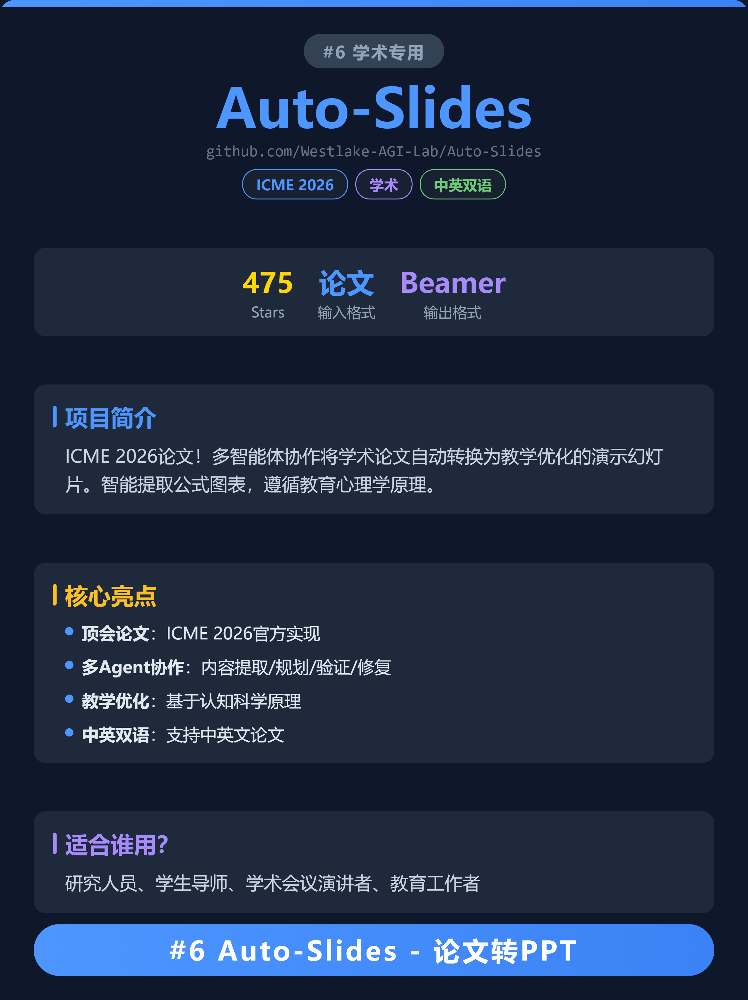

# xhs-trending-cards

> 小红书知识卡片 & 公众号贴图生成 Skill - 一键生成精美深色科技风社交传播卡片

为 AI Agent 设计的小红书/公众号卡片生成技能。给定任意榜单数据，自动生成 1242x1660px 精美深色科技风卡片 + 发布文案，支持 html2canvas 一键批量下载高清 PNG。

## 为什么用这个？

- 社交传播场景对视觉要求极高 - 粗糙的截图没人愿意点
- 手动做图耗时 - 一套5张卡片至少2小时
- 文案有套路 - 高点击率标题/标签/发布时间都有公式
- 这个 Skill 让 AI Agent 一键完成：数据采集 -> 卡片生成 -> 文案输出

## 效果预览

### 案例1: AI PPT 生成工具 Top6
7张卡片（1封面 + 6详情），暖色渐变风格

<p align="center">
  
  
  
  
  
  
  
</p>

- 卡片 HTML: [examples/01-github-ai-trending-top5/cards.html](examples/01-github-ai-trending-top5/cards.html)
- 发布文案: [examples/01-github-ai-trending-top5/copywriting.md](examples/01-github-ai-trending-top5/copywriting.md)

### 案例2: GitHub 2026 年度十大开源工具
11张卡片（1封面 + 10详情），多主题色区分

- 卡片 HTML: [examples/02-github-2026-top10-tools/cards.html](examples/02-github-2026-top10-tools/cards.html)
- 发布文案: [examples/02-github-2026-top10-tools/copywriting.md](examples/02-github-2026-top10-tools/copywriting.md)

### 案例3: GitHub AI 开源项目 Top5
6张卡片（1封面 + 5详情），深色科技风渐变主题色

- 卡片 HTML: [examples/03-ai-ppt-tools-top6/cards.html](examples/03-ai-ppt-tools-top6/cards.html)
- 发布文案: [examples/03-ai-ppt-tools-top6/copywriting.md](examples/03-ai-ppt-tools-top6/copywriting.md)

### 案例4: Kimi K2.6 重磅发布（Apple/Mi 极简风格）
2张卡片（1封面 + 1详情），纯黑底 + 白大字 + 月之暗面橙品牌色，适用于重磅产品发布
- 风格：Style B - Apple/Mi 极简风格（纯黑#000 + 白大字 + #ff6b35橙重点色）
- 卡片 HTML: [examples/04-kimi-k26-apple-style/cards.html](examples/04-kimi-k26-apple-style/cards.html)
- 发布文案: [examples/04-kimi-k26-apple-style/copywriting.md](examples/04-kimi-k26-apple-style/copywriting.md)

## 视觉风格（两种可选）

### Style A: 深色科技风（默认）
- 藏青底(#0f172a) + 卡片(#1e293b) + 多彩主题色
- CSS Grid 三行布局：12px主题色顶栏 + 弹性主内容区 + CTA按钮区
- 排名徽章系统：金/银/铜渐变徽章
- 信息层级：左侧竖线色块区分模块（蓝/金/紫）

### Style B: Apple/Mi 极简
- 纯黑底(#000) + 纯白大字 + 橙品牌色(#ff6b35)点缀
- 字号大、信息密、留白少（封面主标题148px+，统计数据64px）
- 零emoji、无花哨装饰，克制用色，冲击力强
- 适用场景：重磅发布、明星产品、冲击力海报

### Retina 级输出
html2canvas 2x 渲染 + 精确裁剪，输出 2484x3320 高清 PNG

## Quick Start

1. **Get data** - 使用 GitHub Trending API / 网页搜索 / 用户提供数据
2. **Confirm scope** - 卡片风格(默认深色科技风)、数量(封面 + N张详情)
3. **Generate HTML** - 基于 `assets/card_template.html` 模板填充数据
4. **Preview** - 浏览器预览效果
5. **Download** - 点击按钮一键批量下载 PNG

## Project Structure

```
xhs-trending-cards/
├── README.md                          # 项目文档
├── SKILL.md                           # AI Agent Skill 定义
├── LICENSE                            # MIT 许可证
├── assets/
│   ├── card_template.html             # HTML 卡片模板 - Style A 深色科技风
│   └── card_template_apple.html       # HTML 卡片模板 - Style B Apple/Mi 极简风
├── references/
│   └── copywriting_guide.md           # 小红书文案写作指南
└── examples/                          # 优秀案例
    ├── 01-github-ai-trending-top5/
    │   └── cards.html                 # Style A
    ├── 02-github-2026-top10-tools/
    │   └── cards.html                 # Style A
    ├── 03-ai-ppt-tools-top6/
    │   └── cards.html                 # Style A
    └── 04-kimi-k26-apple-style/
        ├── cards.html                 # Style B Apple/Mi 极简
        └── copywriting.md
```

## Workflow

### Phase 1: 数据采集

| 数据来源 | 方式 | 适用场景 |
|----------|------|----------|
| GitHub Trending API | 周榜/日榜 JSON | 开源项目榜单 |
| NPM Registry API | 关键词搜索 | 前端工具排行 |
| 网页搜索 | 多平台采集 | 综合趋势 |
| 用户自定义 | CSV/JSON/文本 | 任意主题 |

**统一输出格式**:
```json
[
  { "name": "Project Name", "desc": "一句话定位", "stars": "351K", "url": "github.com/org/repo", "tags": ["TypeScript","AI"], "rank": 1 }
]
```

### Phase 2: 卡片生成

基于 `assets/card_template.html` 模板：
- CSS Grid 3行布局: `grid-template-rows: 12px 1fr auto`
- 封面卡: 徽章 + 标题 + 副标题 + 排名列表 + CTA
- 详情卡: 排名徽章 + 项目名 + URL + 标签 + 数据行 + 简介/亮点/受众模块

### Phase 3: 文案输出

遵循 `references/copywriting_guide.md` 生成发布文案：
- 5个标题选项（情绪词 + 数字 + 话题）
- 正文结构（Hook + 逐项介绍 + 互动引导）
- 20个精准标签（广域 + 精准 + 热门）
- 发布时间建议

## Color Palette

### Style A: 深色科技风

```
Background:        #0f172a (深海军蓝)
Card inner:        #1e293b (石板灰)
Text primary:      #e2e8f0
Text secondary:    #cbd5e1
Text muted:        #94a3b8

Theme colors (per card):
  Cyan:            #00d4ff  (排名1, 科技)
  Silver:          #e2e8f0  (排名2)
  Bronze:          #cd7f32  (排名3)
  Purple:          #a78bfa  (排名4-5)
  Gold:            #fbbf24  (高亮模块)
  Green:           #34d399  (正向数据)
  Pink:            #f472b6  (点缀)

Stars 徽章:        background #fef3c7, color #92400e
排名 #1:           gradient(#ffd700, #ffaa00) bg, 黑色字
排名 #2:           gradient(#c0c0c0, #a0a0a0) bg, 黑色字
排名 #3:           gradient(#cd7f32, #b8860b) bg, 白色字
排名 4+:           #334155 bg, 弱化字
```

### Style B: Apple/Mi 极简

```
Background:        #000000 (纯黑)
Text primary:      #ffffff (纯白)
Brand primary:      #ff6b35 (月之暗面橙)
Brand secondary:   #ff9500 / #ffd600 (二级强调)
Text muted:        #555555
Border/dot:        #1a1a1a / #222222
```

## Typography Scale (1242x1660px)

| 元素 | 字号 | 字重 | 颜色 |
|------|------|------|------|
| 封面标题 | 88px | 800 | 渐变 |
| 项目名 | 90px | 800 | --theme |
| 排名徽章 | 28px | 900 | 渐变/弱化 |
| 模块标题 | 38px | 700 | --theme |
| 正文 | 30px | normal | #cbd5e1 |
| 数据值 | 46px | 900 | varies |
| CTA按钮 | 44px | 700 | 白色 |

## Template Variables

模板使用以下替换变量：

| 变量 | 说明 | 示例 |
|------|------|------|
| `{{THEME_COLOR}}` | 主题色 | `#00d4ff` |
| `{{COVER_BADGE}}` | 封面徽章文字 | `GitHub Trending - This Week` |
| `{{COVER_TITLE}}` | 封面主标题 | `AI开源项目 Top5` |
| `{{PROJECT_LIST}}` | 排名列表 HTML | 5个 `.project-item` |
| `{{ITEM_NAME}}` | 项目名 | `OpenClaw` |
| `{{INTRO_TEXT}}` | 项目简介 | 一段描述 |
| `{{FEATURE_LIST}}` | 亮点列表 HTML | 4个 `.feature-item` |
| `{{TARGET_AUDIENCE}}` | 目标用户 | 谁适合用 |
| `{{CTA_TEXT}}` | 底部按钮文字 | `#1 OpenClaw` |

## Tech Stack

- HTML5 + CSS3 (纯 CSS Grid 布局，零依赖)
- html2canvas (客户端 PNG 生成)
- JavaScript (下载自动化)
- Google Fonts / 系统字体 (可选)

## 适用场景

- 小红书知识卡片 / 榜单卡片 / 排行榜图片
- 微信公众号文章配图
- 知乎/即刻/微博等技术分享图
- GitHub 项目 README 头图
- 产品发布/周报/盘点等可视化传播

## License

MIT

## Author

Built for AI agents and content creators.
